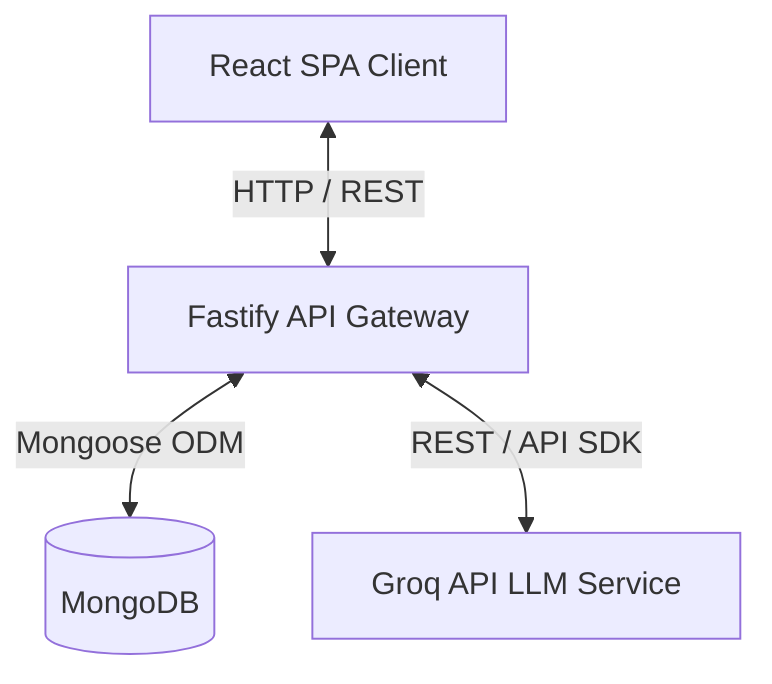

# Architecture Overview

This document describes the high-level architecture of the **AI Smart Helpdesk Assistant for Automated Customer Support**.

---

## 🏗️ System Overview

The system consists of:
1. **Single Page Application (SPA)**: Built with React, Vite, and Tailwind CSS. State is managed globally via Redux Toolkit and routing is handled via React Router.
2. **REST API Gateway**: Built with Fastify. Fastify utilizes a high-efficiency plugin architecture, serving endpoints for authentication, tickets, chatbot, and analytics.
3. **Database**: MongoDB handles persistence using Mongoose ODM models.
4. **AI Processing Layer**: An integration wrapper interacting with the Groq API (Meta Llama models) for instant chat completions and classification.

---

## 📂 Backend Layers & Organization

Fastify operates around standard plugins and encapsulated contexts. To ensure high scalability, our backend follows clean Separation of Concerns (SoC):

1. **`server.js`**: Instantiates and runs the server listener on the specified port.
2. **`app.js`**: Registers core cross-cutting concerns (CORS, body parsing, Mongoose connector plugin) and sets up the routing prefixes.
3. **`config/db.js`**: Handles MongoDB lifecycle events (`connected`, `error`, `disconnected`).
4. **`routes/`**: Grouped by features (e.g. `health.js`, future `auth.js`, `tickets.js`). Maps endpoints to controllers.
5. **`controllers/`**: Parses incoming request parameters, validates formats, calls service layers, and returns JSON payloads.
6. **`services/`**: Holds core business workflows, calculations, third-party API integrations (e.g., Groq completions), and database transactions.
7. **`models/`**: Defines schemas and custom static hooks using Mongoose.
8. **`middleware/`**: Custom hooks for authorization, role-verification, and schema validations.

---

## 📂 Frontend Architecture & Flow

The frontend client is structured to remain lightweight, maintainable, and visually cohesive:

1. **Routing (`src/routes/`)**: Maps paths to views under layouts. Employs lazy loading for performance.
2. **State Management (`src/redux/`)**: Centered around a Redux Toolkit store. Custom slices encapsulate state modifications per module (auth, tickets, chat).
3. **Services (`src/services/`)**: Custom HTTP clients wrapper built on Axios, isolating network logic.
4. **Layouts (`src/layouts/`)**: Shared visual wrappers (e.g., Header, Sidebars, Footers, and Content wrappers) that preserve view states during route changes.
5. **Components (`src/components/`)**: Clean atomic design structure consisting of reusable items (Buttons, InputFields, GlassCard, Badge, etc.).
6. **Pages (`src/pages/`)**: Distinct dashboard routes and views (Home, Login, Support, Dashboard, etc.).
7. **Aesthetics & Styling**: Built on **Tailwind CSS v4** styling framework, introducing highly modern glassmorphic overlays, vibrant gradients, and CSS keyframe micro-animations for responsiveness.
